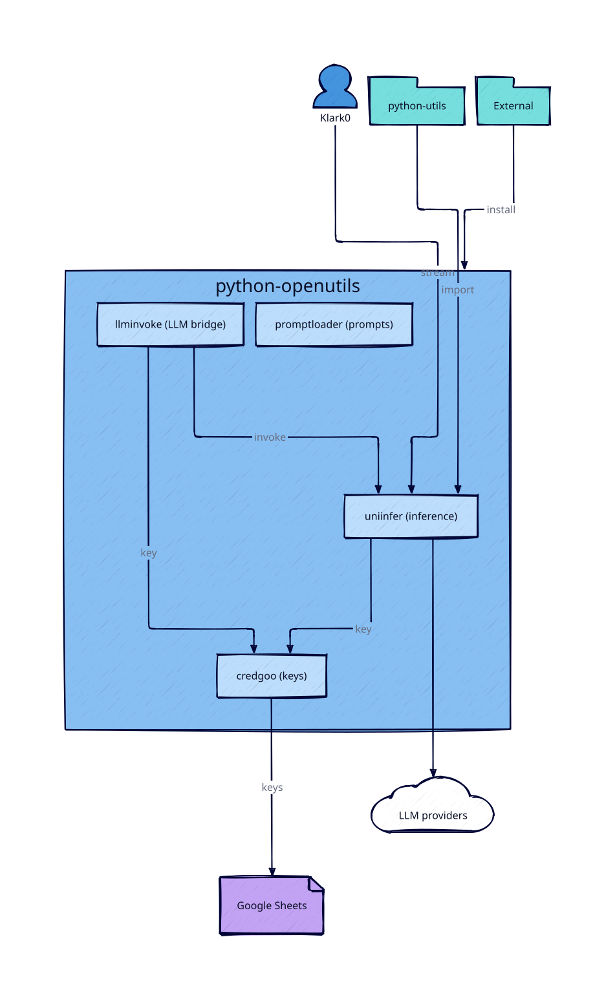
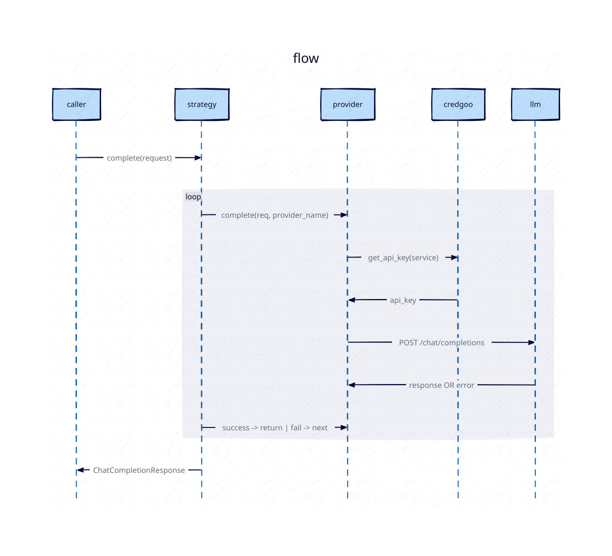

# python-openutils — diagrams

Diagrams as code ([D2](https://d2lang.com)). Edit the `.d2`, re-render the `.svg`.

## Re-render

```bash
d2 architecture.d2 architecture.svg --sketch --theme 4
d2 request-flow.d2  request-flow.svg  --sketch --theme 4
```

Requires `brew install d2`. Drop `--sketch` for clean vectors; `d2 themes` lists other palettes.

## Package architecture



The four packages and how they relate:

- **credgoo** — API keys (sourced from Google Sheets, cached).
- **uniinfer** — unified LLM inference across 15+ providers, with streaming + fallback.
- **llminvoke** — the high-level bridge: `call_llm` / `invoke_llm` / `stream_llm` glue credgoo + uniinfer.
- **promptloader** — standalone 5-tier prompt resolution (used by the kontext.one engine).

**Consumers:** klark0 (HTTP → uniinfer proxy at `/api/ai/uniinfer/stream`), python-utils
(imports), external installs (`uv pip install -r https://skale.dev/…`).

**Edges:** `llminvoke → {uniinfer, credgoo}`; `uniinfer → credgoo` (optional key fetch);
`uniinfer → LLM providers`; `credgoo → Google Sheets`.

## Chat request through uniinfer



`FallbackStrategy.complete` tries providers in order; per attempt the provider fetches its
key (credgoo) and calls the LLM; on failure it moves to the next provider, returning the
first success — or `ProviderError` if all fail.
