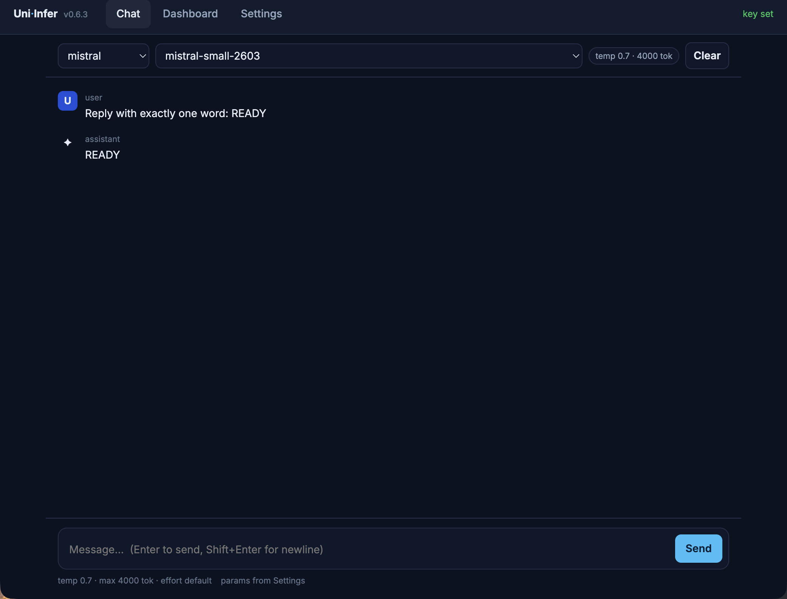
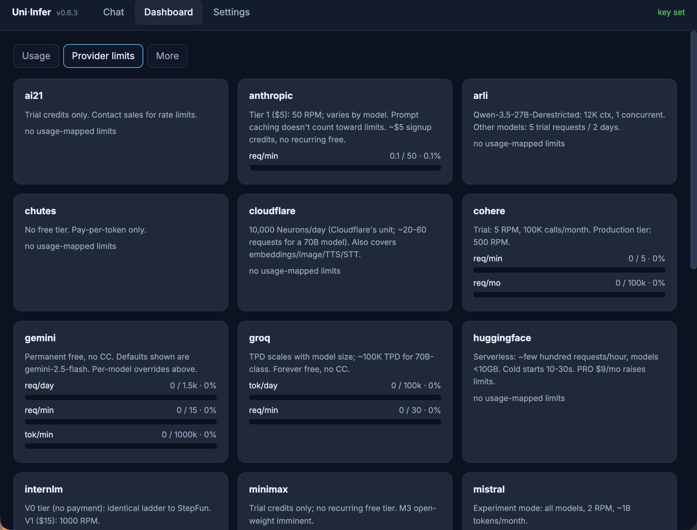
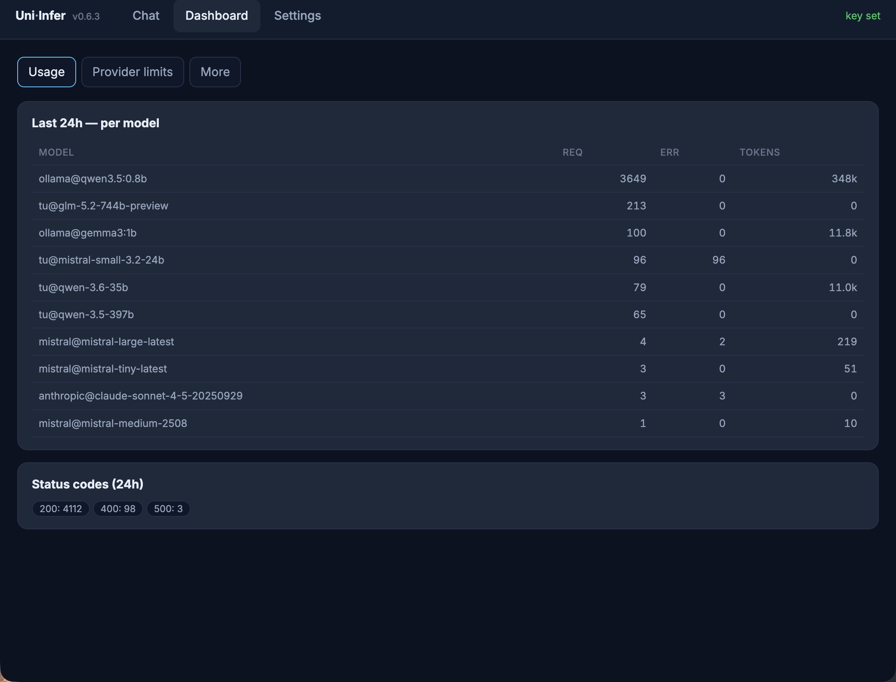
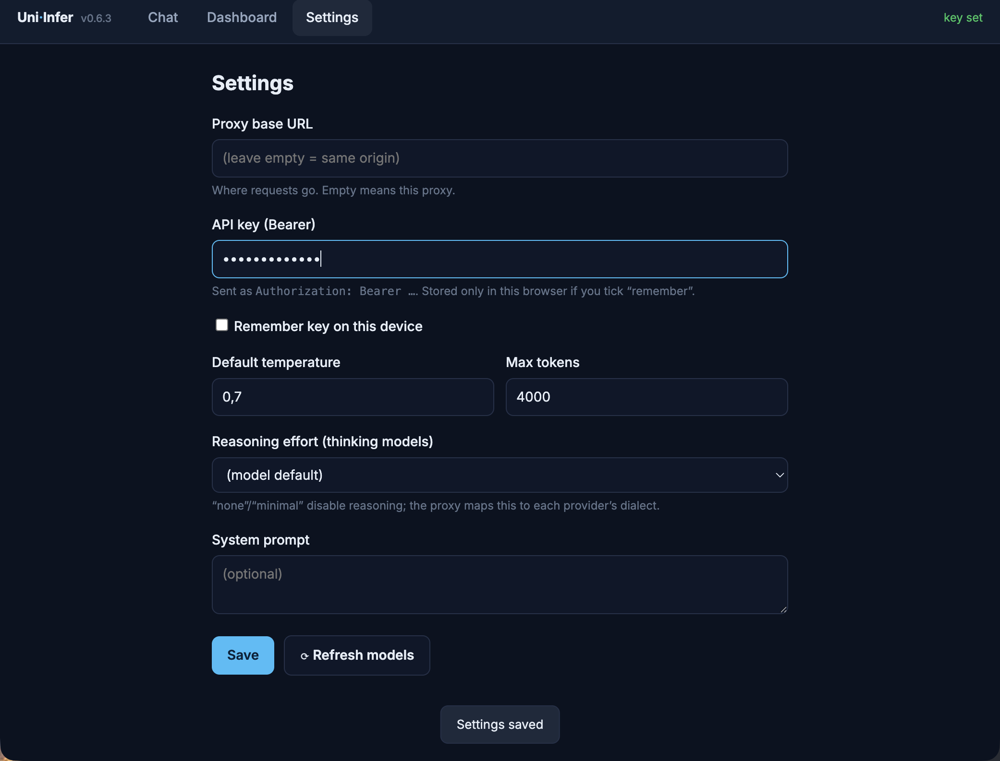

# UniInfer

[](#)
[](#)
[](#)
[](#)

> **One interface for 20+ LLM providers** — chat, embeddings, TTS, STT, streaming,
> tool-calling, and cross-provider reasoning control, behind a single API and an
> OpenAI-compatible proxy. Free-tier-friendly.

- 🌐 **25 providers, 900+ models** — OpenAI, Anthropic, Gemini, Mistral, Groq, Ollama, vLLM (TU), OpenRouter, OpenCode/Zen, and more
- 🧠 **Unified thinking control** — `reasoning_effort` flips reasoning on/off across every provider's native dialect
- 🔌 **OpenAI-compatible proxy** — drop-in for any OpenAI client; model id is `provider@model`
- 🖥️ **Web app** — Chat / Dashboard / Settings served at `/`
- 🔐 **Key management via [credgoo](https://github.com/devskale/python-openutils/tree/main/packages/credgoo)** — one token unlocks every provider
- ⚡ **Streaming, tools, embeddings, TTS, STT, fallback strategies**

<table>
  <tr>
    <td width="50%" align="center"><b>Chat</b><br/><sub>streaming + markdown + reasoning aside</sub><br/></td>
    <td width="50%" align="center"><b>Dashboard — Provider limits</b><br/><sub>free-tier limits vs live usage</sub><br/></td>
  </tr>
</table>

---

## Quick start

```bash
# Into a project
uv pip install -r https://skale.dev/uniinfer
# …or from source
git clone https://github.com/devskale/python-openutils.git
cd python-openutils/packages/uniinfer && uv sync
```

```python
from uniinfer.completion import Target

# api_key auto-resolves via credgoo if you pass None and a key is configured
resp = Target("mistral@mistral-small-latest", api_key=None).complete(
    [{"role": "user", "content": "Reply with exactly: OK"}],
    max_tokens=40,
)
print(resp.message.content)   # → OK
```

### Or, the OpenAI-compatible proxy

```bash
uv run uvicorn uniinfer.proxy_app:app --host 0.0.0.0 --port 8123
```

```python
from openai import OpenAI
client = OpenAI(base_url="http://localhost:8123/v1",
                api_key="CREDGOO_BEARER@ENCRYPTION")   # credgoo combo
print(client.chat.completions.create(
    model="tu@qwen-3.6-35b",                            # provider@model
    messages=[{"role": "user", "content": "Hello!"}],
).choices[0].message.content)
```

Then open **`http://localhost:8123/`** for the web app (Chat / Dashboard / Settings).

---

## Thinking control (reasoning)

Thinking models (Qwen3.x, GLM, o1-style) reason *before* the visible answer.
UniInfer unifies this behind one intent — **`reasoning_effort`** — so you set it
once and every provider maps it to its own dialect (ollama `think`, vLLM
`chat_template_kwargs`, Z.AI `thinking`, …):

```python
Target("ollama@qwen3.5:0.8b").complete(
    [{"role": "user", "content": "What is 7×6?"}],
    max_tokens=2048, reasoning_effort="high",   # "none"/"minimal" disable reasoning
)
```

| `reasoning_effort` | meaning |
|---|---|
| `none`, `minimal` | reasoning **off** (fast, deterministic) — the cross-provider contract |
| `low`, `medium`, `high` | reasoning on, increasing effort |

> **Footgun:** thinking models spend the token budget on reasoning *before* the
> answer — a tiny `max_tokens` yields empty output. Keep it ≫ 1–2k, or disable
> reasoning with `reasoning_effort="none"`. The proxy chat path defaults to
> `32768`; the unified `--no-think` CLI flag sets `reasoning_effort="none"`.

---

## Supported providers

See [docs/providers.md](docs/providers.md) for the full index with base URLs,
free tiers, and rate limits (baked into `config/provider_limits.json`).

| Provider | Chat | Embed | TTS | STT | Free | Models |
|----------|:----:|:-----:|:---:|:---:|:----:|-------:|
| OpenRouter | ✅ | — | — | — | ✅ | 337 |
| NVIDIA NGC | ✅ | — | — | — | — | 120 |
| OpenAI | ✅ | ✅ | ✅ | — | — | 112 |
| Mistral | ✅ | — | — | — | — | 69 |
| Cloudflare | ✅ | — | — | — | — | 58 |
| Pollinations | ✅ | — | — | — | ✅ | 57 |
| Gemini | ✅ | — | — | — | — | 55 |
| Arli AI | ✅ | — | — | — | — | 52 |
| StepFun | ✅ | — | — | — | — | 35 |
| Groq | ✅ | — | — | — | — | 16 |
| Chutes | ✅ | — | — | — | — | 13 |
| TU Wien (vLLM) | ✅ | ✅ | ✅ | ✅ | — | 9 |
| Moonshot | ✅ | — | — | — | — | 9 |
| Upstage | ✅ | — | — | — | — | 8 |
| Z.AI | ✅ | — | — | — | ✅ | 7 |
| Z.AI Code | ✅ | — | — | — | — | 7 |
| SambaNova | ✅ | — | — | — | — | 6 |
| Ollama | ✅ | ✅ | — | — | ✅ | 5 |
| OpenAI TTS | — | — | ✅ | — | — | 2 |
| AI21 | ✅ | — | — | — | — | 2 |
| Anthropic | ✅ | — | — | — | — | — |
| Cohere | ✅ | — | — | — | — | — |
| HuggingFace | ✅ | — | — | — | — | — |
| InternLM | ✅ | — | — | — | — | — |
| MiniMax | ✅ | — | — | — | — | — |
| OpenCode (Zen) | ✅ | — | — | — | ✅ | — |

Model counts from `models.json` (regenerated daily 04:00 UTC). Free = provider offers free-tier models.

> 💸 **Free models available now** — OpenCode/Zen ships six free models
> (`opencode@deepseek-v4-flash-free`, `big-pickle`, `mimo-v2.5-free`, `hy3-free`,
> `nemotron-3-ultra-free`, `north-mini-code-free`); plus Groq (forever free),
> Pollinations (no key), Z.AI flash, and self-hosted Ollama (unlimited).

---

## Library usage

### Streaming

```python
target = Target("anthropic@claude-3-5-sonnet-20241022")
for chunk in target.stream_complete([{"role": "user", "content": "Tell me a story"}]):
    print(chunk.message.content, end="", flush=True)
```

### Tool calling

```python
tools = [{"type": "function", "function": {
    "name": "get_weather", "parameters": {"type": "object",
        "properties": {"location": {"type": "string"}}, "required": ["location"]}}}]
resp = Target("mistral@mistral-small-latest").complete(
    [{"role": "user", "content": "Weather in Paris?"}],
    tools=tools, tool_choice="auto", max_tokens=256,
)
print(resp.message.tool_calls)   # → [{ "function": { "name": "get_weather", ... }}]
```

### Embeddings, TTS, STT, fallback

```python
from uniinfer import EmbeddingProviderFactory, EmbeddingRequest
from uniinfer import FallbackStrategy

# embeddings (separate factory — different request type)
vec = EmbeddingProviderFactory.get_provider("ollama").embed(
    EmbeddingRequest(input=["hello"], model="nomic-embed-text-v2-moe"))

# try multiple providers until one succeeds
strategy = FallbackStrategy(provider_names=["openai", "anthropic", "ollama"])
resp, used = strategy.complete(request)
```

### Low-level: talk to a provider directly

`Target` is the dispatch handle; `ProviderFactory` is the lower-level seam when
you need a raw provider instance:

```python
from uniinfer import ProviderFactory, ChatCompletionRequest, ChatMessage
provider = ProviderFactory.get_provider("groq")
resp = provider.complete(ChatCompletionRequest(
    model="llama-3.1-8b-instant",
    messages=[ChatMessage(role="user", content="Hi")],
))
```

---

## The proxy

An OpenAI-compatible FastAPI server. Model ids are **`provider@model`**
(e.g. `tu@qwen-3.6-35b`, `ollama@qwen3.5:0.8b`).

### Endpoints

| Endpoint | Method | Description |
|----------|--------|-------------|
| **`/`** | GET | **Web app** — Chat / Dashboard / Settings |
| `/v1/chat/completions` | POST | Chat (stream + non-stream) |
| `/v1/embeddings` | POST | Embeddings |
| `/v1/models` · `/v1/catalog` | GET | Cached models · raw catalog (`?providers=`, `&download=1`) |
| `/v1/models/{provider}` | GET | Live provider models |
| `/v1/models/new` · `/deprecated` · `/stale` | GET | Catalog diffs |
| `/v1/images/generations` · `/v1/audio/speech` · `/v1/audio/transcriptions` | POST | Image / TTS / STT |
| `/v1/system/stats` | GET | Usage stats (24h/7d, per-model) |
| `/v1/system/provider-limits` | GET | **Free-tier limits joined with live usage + utilization %** |
| `/v1/system/rate-limits` | GET | Adaptive AIMD limiter state (TU) |
| `/v1/system/version` | GET | Version |

Dashboards: `/v1/system/stats.html`, `/v1/system/provider-limits.html`, `/capabilities`, `/perf`, `/guide`.

<details>
<summary><b>More screenshots</b></summary>
<table>
  <tr><td width="50%" align="center"><b>Dashboard — Usage</b><br/></td>
      <td width="50%" align="center"><b>Settings</b><br/></td></tr>
</table>
</details>

### Authentication

Bearer token, two forms:
1. **Direct provider key** — `Bearer <PROVIDER_API_KEY>`
2. **Credgoo combo** (multi-provider) — `Bearer <CREDGOO_BEARER>@<CREDGOO_ENCRYPTION>`

Falls back to `CREDGOO_BEARER_TOKEN` / `CREDGOO_ENCRYPTION_KEY` env vars. **Ollama bypasses auth** for local dev. Rate limits: chat 100/min, embeddings 200/min, media 50/min (`UNIINFER_RATE_LIMIT_CHAT`, …).

---

## CLI

```bash
uniinfer -p mistral -m mistral-small-latest -q "Hello"   # chat
uniinfer -p groq --speedtest -m llama-3.1-8b-instant       # benchmark
uniinfer --no-think -p tu -m qwen-3.6-35b -q "Summarise…"  # reasoning off
uniinfer --capabilities -p ollama -m qwen3.5:0.8b          # capability probe
uniinfer --list-providers                                   # providers
uniinfer --new-models 7                                     # new this week
```

---

## Configuration

API keys live in **credgoo**:

```bash
credgoo set openai sk-…        # store a key
credgoo list                   # what's configured
```

Or per-provider env vars for testing: `OPENAI_API_KEY`, `ANTHROPIC_API_KEY`, …

---

## Development

```bash
uv sync --extra all                       # install all provider deps
uv run pytest                             # unit/integration tests (uniinfer/tests/)
uv run black . && uv run isort . && uv run ruff check . --fix   # format + lint
```

### Live testsuite (smoke → details → perf)

The curated tiered suite that talks to a **real proxy + provider**:

```bash
PROXY_URL=http://localhost:8123 PROXY_AUTH=… MODEL=tu@qwen-3.6-35b ./testsuite/run.sh all
./testsuite/run.sh smoke   # alive?  (CLI + proxy)
./testsuite/run.sh details # correct? (reasoning, tools, streaming, turn-based)
./testsuite/run.sh perf    # fast?    (throughput incl. thinking, TTFT, latency)
```

See [testsuite/README.md](testsuite/README.md). Token counting:
`usage.completion_tokens` **includes thinking** (per OpenAI spec); throughput
isolates generation from prefill.

---

## Architecture

Deep modules, small interfaces:

- **`uniinfer.completion.Target`** — the dispatch handle: parse → instantiate →
  request → dispatch → access-recording behind `complete/stream_complete/acomplete/astream_complete`.
- **`uniinfer.core`** — data classes: `ChatCompletionRequest` (with typed
  `reasoning_effort`), `ChatProvider`, `ModelInfo`.
- **`uniinfer.providers/`** — provider adapters; each owns its reasoning dialect.
- **`uniinfer.proxy_app`** + `proxy_routers/` + `proxy_services/` + `proxy_schemas/` — the OpenAI-compatible proxy.

Full layout + the **Naming** table (`uniioai_proxy.py` → `proxy_app.py`):
[ARCHITECTURE.md](ARCHITECTURE.md).

## Docs

- [ARCHITECTURE.md](ARCHITECTURE.md) — proxy layout + naming
- [AGENTS.md](AGENTS.md) — contributor rules, provider patterns
- [docs/providers.md](docs/providers.md) — provider index (URLs, free tiers, limits)
- [docs/models.md](docs/models.md) — model catalog
- [docs/integration.md](docs/integration.md) — integration guide (Python + proxy)
- [CHANGELOG.md](CHANGELOG.md)

## Contributing

Fork → branch → tests pass → `black` + `isort` + `ruff` → PR. See [AGENTS.md](AGENTS.md) for provider-implementation patterns and the boundaries (ask before changing `core.py`'s public API).

## License

MIT
